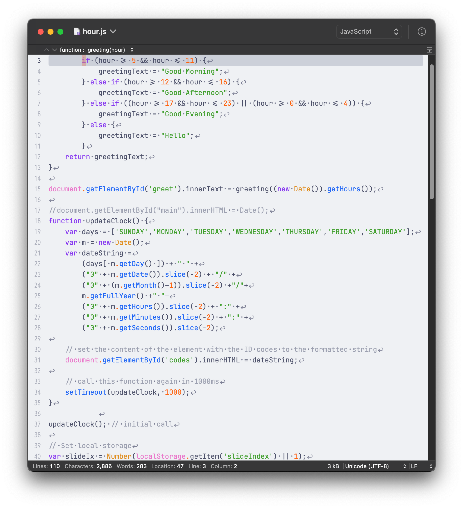
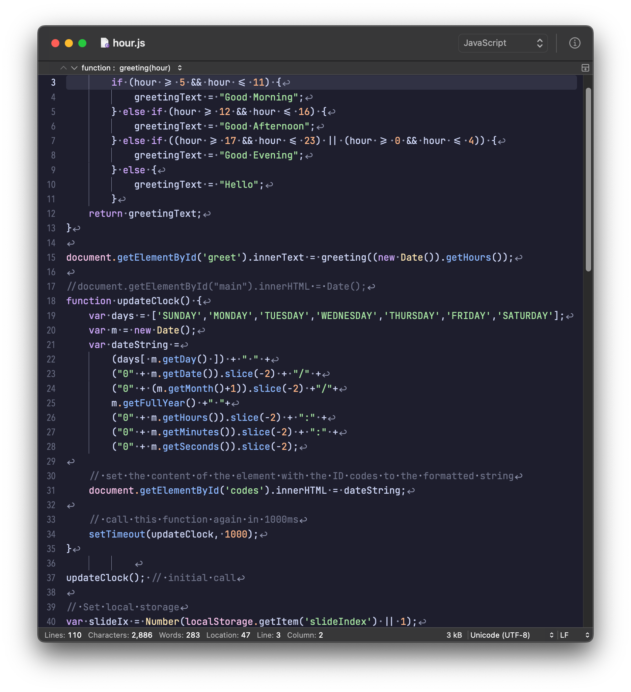

<h3 align="center">
	<br/>
	
	Catppuccin for <a href="https://coteditor.com/">CotEditor</a>
</h3>

<p align="center">
	<a href="https://github.com/aravezskinteeth/coteditor/stargazers"></a>
	<a href="https://github.com/aravezskinteeth/coteditor/issues"></a>
	<a href="https://github.com/aravezskinteeth/coteditor/contributors"></a>
</p>

<p align="center">
	
</p>

## Previews

<details>
<summary>🌻 Latte</summary>

</details>
<details>
<summary>🪴 Frappé</summary>

</details>
<details>
<summary>🌺 Macchiato</summary>

</details>
<details>
<summary>🌿 Mocha</summary>

</details>

## Usage

1. Clone this repository locally
   ```shell
   git clone https://github.com/aravezskinteeth/coteditor.git
   ```
2. Open `CotEditor`.
3. Go to the menu **CotEditor** > **Preferences** 
4. Select **Appearance**.
5. Click on the `...` on the *Themes* section.
6. Select `Import...` and browse to where you cloned this repo.
7. Go to the themes directory and select your flavour.

## 🙋 FAQ

- Q: **_"Which font are you using in the previews?"_**\
  A: I'm using a patched nerd version of the [JetBrainsMono](https://www.nerdfonts.com/font-downloads) font in size 14.

- Q: **_"What other settings do you use in the previews"_**\
  A: I have enabled **Anti-aliasing**, **Ligatures**. Line height is set to 1.2. **Change background color** is enabled. The cursor is set to **block**. And most importanly, I've enabled **Show invisible characters**, such as **spaces**, **other whitespaces** and **Show indent guides**.

## 💝 Thanks to

- [aravezskinteeth](https://github.com/aravezskinteeth)

&nbsp;

<p align="center">
	
</p>

<p align="center">
	Copyright &copy; 2021-present <a href="https://github.com/catppuccin" target="_blank">Catppuccin Org</a>
</p>

<p align="center">
	<a href="https://github.com/catppuccin/catppuccin/blob/main/LICENSE"></a>
</p>
